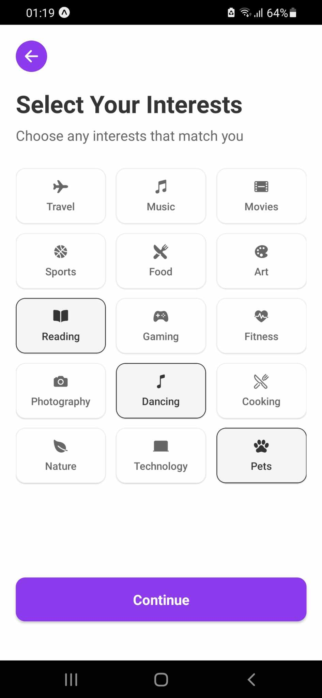
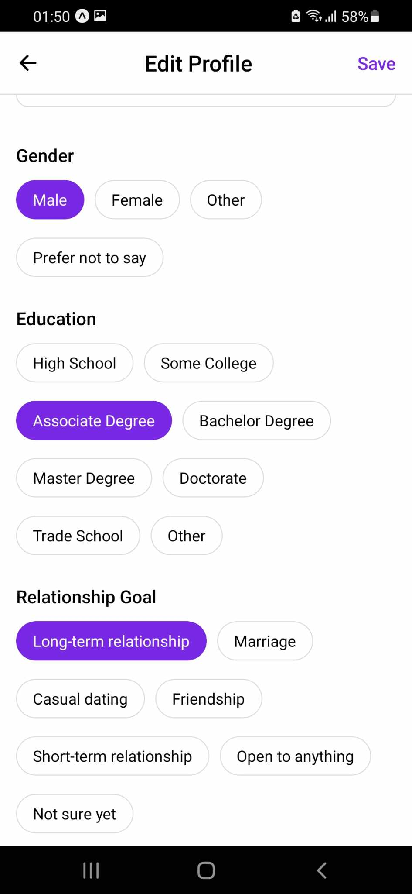

# Linder - Dating App

A modern dating application built with React Native, inspired by Tinder. Match, chat and connect with people nearby based on your preferences.

## Features

-  👥 Smart matching system based on location, interests and preferences
-  💬 Real-time chat with matches
-  📍 Location-based matching
-  📸 Multiple photos upload and management
-  🔍 Advanced filtering system
-  📱 Cross-platform (iOS & Android)
-  🔐 Authentication with email and phone number

 ## Screenshots

<div align="center">
  
  
  
  <br>
  
  
  
</div>


## Tech Stack

### Frontend

-  React Native / Expo
-  Redux for state management
-  React Navigation
-  Expo Location
-  React Native Gesture Handler

### Backend

-  Node.js / Express
-  PostgreSQL with PostGIS
-  Firebase (Authentication & Real-time chat)
-  Cloudinary (Image management)

## Getting Started

### Prerequisites

-  Node.js 14+
-  PostgreSQL with PostGIS extension
-  Firebase account
-  Cloudinary account

### Installation

1. Clone the repository

```bash
git clone https://github.com/yourusername/linder.git
cd linder
````

2. Install dependencies

```bash
npm install
```

3. Set up environment variables
   Create a .env file in the root directory and add:

```env
# Database Configuration
DB_USER=your_db_user
DB_HOST=localhost
DB_NAME=your_db_name
DB_PASSWORD=your_password
DB_PORT=5432

# Cloudinary Configuration
CLOUDINARY_CLOUD_NAME=your_cloud_name
CLOUDINARY_API_KEY=your_api_key
CLOUDINARY_API_SECRET=your_api_secret

# Firebase Configuration
FIREBASE_API_KEY=your_api_key
FIREBASE_AUTH_DOMAIN=your_auth_domain
FIREBASE_PROJECT_ID=your_project_id
...
```

4. Start the development server

```bash
npm start
```

5. Run the app

```bash
# For iOS
npm run ios

# For Android
npm run android
```

## API Documentation

The API documentation is available at `/api-docs` when running the development server.

## Contributing

1. Fork the repository
2. Create your feature branch (`git checkout -b feature/AmazingFeature`)
3. Commit your changes (`git commit -m 'Add some AmazingFeature'`)
4. Push to the branch (`git push origin feature/AmazingFeature`)
5. Open a Pull Request


## Contact

Nguyễn Ngọc Tuấn - [ngoctuan090904@gmail.com]

## Acknowledgments

- [React Native](https://reactnative.dev/)
- [Expo](https://expo.dev/)
- [Firebase](https://firebase.google.com/)
- [Cloudinary](https://cloudinary.com/)
